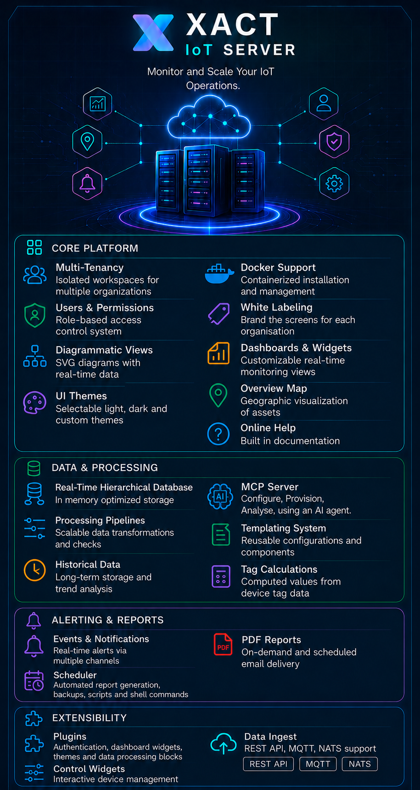

# XACT - Industrial IoT Platform



XACT is a industrial IoT platform designed for real-time monitoring, data acquisition, and process automation. XACT handles everything from hobby projects to lab deployments to installations with hundreds or even thousands of devices.

## Table of Contents

- [1. Preview](#1-preview)
- [2. Installation](#2-installation)
  - [2.1. Linux and Darwin](#21-linux-and-darwin)
    - [2.1.1. Automatically Starting the Server after a Reboot](#211-automatically-starting-the-server-after-a-reboot)
  - [2.2. Docker](#22-docker)
  - [2.3. Windows](#23-windows)
  - [2.4. First Login](#24-first-login)
  - [2.5. Sending Data to XACT](#25-sending-data-to-xact)
  - [2.6. Next Steps](#26-next-steps)
- [3. Core Platform](#3-core-platform)
  - [3.1. Multi-Tenancy](#31-multi-tenancy)
  - [3.2. Users & Permissions](#32-users--permissions)
  - [3.3. Dashboards & Widgets](#33-dashboards--widgets)
  - [3.4. Overview Map](#34-overview-map)
  - [3.5. SVG diagrams](#35-svg-diagrams)
  - [3.6. UI Themes](#36-ui-themes)
  - [3.7. Online Help](#37-online-help)
- [4. Data & Processing](#4-data--processing)
  - [4.1. Real-Time Hierarchical Database](#41-real-time-hierarchical-database)
  - [4.2. Templating System](#42-templating-system)
  - [4.3. Processing Pipelines](#43-processing-pipelines)
  - [4.4. Tag Calculations](#44-tag-calculations)
  - [4.5. Historical Data](#45-historical-data)
- [5. Alerting & Reports](#5-alerting--reports)
  - [5.1. Events & Notifications](#51-events--notifications)
  - [5.2. PDF Reports](#52-pdf-reports)
  - [5.3. Scheduler](#53-scheduler)
- [6. Extensibility](#6-extensibility)
  - [6.1. Plugins](#61-plugins)
  - [6.2. Data Ingest](#62-data-ingest)
  - [6.3. Control Widgets](#63-control-widgets)
- [7. Deployment Options](#7-deployment-options)
  - [7.1. Small - Evaluation, Lab, Demo](#71-small---evaluation-lab-demo)
  - [7.2. Medium - Production Workloads](#72-medium---production-workloads)
  - [7.3. Large - Enterprise Scale (coming soon)](#73-large---enterprise-scale-coming-soon)
- [8. Roadmap](#8-roadmap)
- [9. Learn More](#9-learn-more)

---

## 1. Preview

- **Screen shots:** [View screenshots](screenshots/README.md)
- **Demo Website:** [XACT demo](https://xact.dedyn.io)


## 2. Installation

XACT does not have a separate installer. The deployment archive is copied to a suitable directory, unpacked, configured through the `.env` file, and started with the included startup script. The packaged `.env` uses evaluation-friendly defaults with generated secrets, direct HTTP serving, unsafe scheduler tasks disabled, browser command publishing disabled, and internal NATS credentials hidden.

### 2.1. Linux and Darwin

Download the platform archive, replacing `<os>`, `<arch>`, and `<version>` with the release you need. Valid `<os>` values are `linux` and `darwin`. Use `amd64`, `arm64`, or `arm` for Linux `<arch>`; use `amd64` or `arm64` for Darwin `<arch>`.

`Note`: At this time only linux/amd64 has been tested. Other os/arch combinations cross compile cleanly and that usually means they will run successfully on the target. If you run XACT on alternative hardware, kindly give feedback as to how it went.

```sh
mkdir -p ~/xact
cp xact-<os>-<arch>-<version>.tar.gz ~/xact/
cd ~/xact
tar -xzf xact-<os>-<arch>-<version>.tar.gz
```

Review `.env` before first start. For a local evaluation, the packaged defaults are enough:

```sh
./start.sh
```

Open the system at `http://localhost:8080/xact/`, or from another browser on the same trusted local network at `http://<server-host>:8080/xact/`.

#### 2.1.1. Automatically Starting the Server after a Reboot

Use the platform service manager to run `start.sh` from the XACT directory after boot.

Systemd based distributions usually use a unit that sets `WorkingDirectory` to the XACT install directory and runs `./start.sh`.

init.d based systems, Alpine, and custom Linux builds can use an init script that changes to the XACT install directory before starting the script.

See the `Next Steps` section below.

### 2.2. Docker

The default Docker deployment uses Docker Compose with XACT, Caddy, and PostgreSQL/TimescaleDB. For other container managers, such as Kubernetes, adjust the deployment as needed.

To deploy with a published image, download the Docker deploy package for your architecture. The package contains `docker-compose.yml` and `.env.example`.

Create a directory for the XACT Docker deployment:

```sh
mkdir -p ~/xact
cp xact-docker-<arch>-<version>.tar.gz ~/xact/
cd ~/xact
tar -xzf xact-docker-<arch>-<version>.tar.gz
```

Extract the package as the user who will run Docker Compose, not with `sudo`, so the writable `plugins/` and `postgres-data/` directories are owned by that user.

```sh
cp .env.example .env
```

Edit `.env` and replace all `change-this...` secrets. 

Change `MQTT_BROKER_URL` to `mqtt://0.0.0.0:1883`

For a public server, also set `XACT_SITE_ADDRESS` to the public DNS name. 

Then start the stack:

```sh
docker compose up -d
```

Open XACT at:

```text
http://localhost/xact/
```

or, when using a public DNS name and Caddy-managed HTTPS:

```text
https://<your-domain>/xact/
```

Plugins are loaded from the writable host directory configured by `XACT_PLUGIN_DIR` in `.env`, defaulting to `./plugins` beside the compose file in the extracted Docker deployment package. XACT creates the standard plugin category subdirectories on first start. Add custom widget, map layer, theme, or authentication plugins there before restarting the `xact` container.

PostgreSQL data is stored in the host directory configured by `POSTGRES_DATA_DIR`, defaulting to `./postgres-data` beside the compose file. The `POSTGRES_PASSWORD` value is only applied when PostgreSQL initializes an empty data directory; changing `.env` later does not change the password inside an existing database.

### 2.3. Windows

Download the Windows archive. The Windows package is xact-windows-amd64-<version>.zip. Replace `<version>` with the release you need.

`Note`: The Windows build has been tested using Wine on Linux, but not on a real Windows system. Please give feedback if any issues are seen.

```powershell
New-Item -ItemType Directory -Force -Path "$env:USERPROFILE\xact"
Copy-Item .\xact-windows-amd64-<version>.zip "$env:USERPROFILE\xact\"
Set-Location "$env:USERPROFILE\xact"
Expand-Archive .\xact-windows-amd64-<version>.zip -DestinationPath . -Force
```

Review `.env` before first start. For a local evaluation, the packaged defaults are enough:

```cmd
start.bat
```

Open the system at `http://localhost:8080/xact/`, or from another browser on the same trusted local network at `http://<server-host>:8080/xact/`.

### 2.4. First Login

The bootstrap user is named `admin`. On a fresh packaged install, no password is set yet; the browser shows a `Set Admin Password` dialog instead of the normal login form. Set the password there and the first admin session starts immediately.

For production deployment guidance, open the online manual after startup and read **Preparing for Production**.

### 2.5. Sending Data to XACT

There are various way to send data to the XACT server and these are described in the online manual. But the simplest way to get started is probably to start with the Python program found in the repo under ```demo/python-example```. This skeleton program sends data via the XACT REST API.

### 2.6. Next Steps

- Open the system at `http://localhost:8080/xact/`, `http://<server-host>:8080/xact/`, or your configured proxy URL.
- On fresh installs, set the initial `admin` password in the browser; scripted installs can log in with the configured bootstrap password.
- Create named administrator users.
- Review `.env` and the **Preparing for Production** manual page before exposing XACT beyond a trusted local network.
- Add device drivers and issue REST ingest API keys only to trusted devices.

## 3. Core Platform

### 3.1. Multi-Tenancy
XACT supports multiple organizations within a single deployment. Each tenant has isolated workspaces, ensuring complete data separation and independent configuration while sharing underlying infrastructure.

### 3.2. Users & Permissions
A comprehensive role-based access control system enables fine-grained permissions. Define custom roles with specific capabilities and assign users to appropriate access levels across the platform.

### 3.3. Dashboards & Widgets
Create customized monitoring views with a rich library of widgets including timeseries charts, gauges, big number displays, sparklines, status tables, and more. Drag-and-drop arrangement makes building dashboards fast and intuitive.

### 3.4. Overview Map
Visualize your entire asset inventory on an interactive geographic map. Pinpoint device locations, view real-time status through color coding, and quickly identify issues across distributed installations.

### 3.5. SVG diagrams
Simple SCADA like diagrams can be created with the built in editor. Diagram elements can be color animated from real time values and standard dashboard widgets can be placed on the diagram.

### 3.6. UI Themes
Adapt the interface to your preferences with selectable themes including light and dark modes, plus custom theme support for brand consistency.

### 3.7. Online Help
Online documentation ensures help is always available where you need it.

### 3.8. MCP server
Use your favorite AI Agent to configure and monitor the XACT server. Prompt to manage the tags or tag calculations or to generate custom reports.

---

## 4. Data & Processing

### 4.1. Real-Time Database
A purpose-built time-series database optimized for industrial data. Hierarchical organization mirrors your physical asset structure, enabling efficient querying and aggregation across equipment hierarchies.

### 4.2. Templating System
Reduce configuration overhead with reusable templates. Define standard configurations once and apply them across multiple devices and locations, ensuring consistency while saving time.

### 4.3. Processing Pipelines
Scalable data transformation pipelines handle ingestion, validation, and enrichment. Built-in support for limit checks, smoothing algorithms, and custom transformation plugins ensure data quality before storage.

### 4.4. Tag Calculations
Define computed values derived from raw sensor data. Create calculated tags that aggregate, derivative, or combine multiple inputs for meaningful metrics and KPIs.

### 4.5. Historical Data
Long-term storage with efficient compression enables trend analysis across months or years of operational data. Query historical ranges for root cause analysis and performance reporting.

---

## 5. Alerting & Reports

### 5.1. Events & Notifications
Real-time alerting across multiple channels. Configure threshold-based alarms, state transitions, and complex event conditions. Currently notifications are sent via email and/or Telegram.

### 5.2. PDF Reports
Generate professional PDF reports on-demand or on schedule. Include real-time data, historical trends, charts, and analysis. Automate delivery via email distribution lists.

### 5.3. Scheduler
Automate routine operations including scheduled report generation, database maintenance, backup operations, and shell command execution. Cron-based scheduling ensures reliable task execution.

---

## 6. Extensibility

### 6.1. Plugins
Extend XACT functionality through a modular plugin system. Add custom authentication providers, specialized dashboard widgets, or proprietary themes - all via standard plugin interfaces.

### 6.2. Data Ingest
Connect to diverse data sources with built-in protocol support:
- **REST API** - Push data from any HTTP-enabled device
- **MQTT** - Subscribe to broker-based telemetry streams
- **NATS** - High-performance native NATS ingestion for low latency

### 6.3. Control Widgets
Interactive control widgets enable operator actions directly from dashboards. Configure setpoints, send commands, and acknowledge alerts - all with proper permission controls and audit logging.

---

## 7. Deployment Options

### 7.1. Small - Evaluation, Lab, Demo
- Supports 10s of devices
- Single executable with embedded SQLite database
- Quick setup, minimal maintenance

### 7.2. Medium - Production Workloads
- Handles 10s of users, 100-1000+ devices
- Separate PostgreSQL database with TSDB extension
- Scalable storage with superior query performance
- Docker Compose deployment with Caddy and TimescaleDB is available in `deploy/docker/`

### 7.3. Large - Enterprise Scale (coming soon)
- Clustered servers for high availability
- Horizontal scaling architecture
- Multi-node container orchestration

---


## 8. Roadmap

- **Redundancy & Clustering** - Deploy multi-node clusters for high availability with automatic failover

---

## 9. Learn More

- **Documentation:** See the online manual.

XACT - *Industrial IoT, Simplified.*
