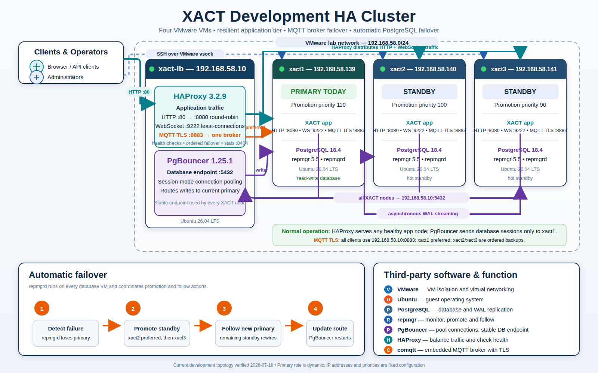

# XACT development HA reference



## Stable endpoints

| Service | Endpoint | Routing |
| --- | --- | --- |
| HTTP / WebSocket | `http://192.168.58.10` | HAProxy health-checks and balances all XACT nodes |
| PostgreSQL | `192.168.58.10:5432` | PgBouncer routes sessions to the current PostgreSQL primary |
| MQTT over TLS | `mqtts://192.168.58.10:8883` | HAProxy TLS passthrough to one broker: xact1, then xact2, then xact3 |

MQTT clients must trust [the development MQTT certificate](certs/mqtt-server.crt). Its certificate names include `xact-lb`, `192.168.58.10`, `localhost`, and `127.0.0.1`; it expires on 18 October 2028. The private key is installed only on the three XACT VMs and is not stored here.

## MQTT node configuration

Each VM uses these non-secret settings, with a node-specific `MQTT_CLIENT_ID`:

```dotenv
EMBEDDED_MQTT_LISTEN_URL=mqtts://0.0.0.0:8883
MQTT_BROKER_URL=mqtts://192.168.58.10:8883
MQTT_TLS_CERT_FILE=./certs/mqtt-server.crt
MQTT_TLS_KEY_FILE=./certs/mqtt-server.key
MQTT_CLIENT_TLS_CA_FILE=./certs/mqtt-server.crt
MQTT_CLIENT_TLS_SERVER_NAME=xact-lb
MQTT_CLIENT_TLS_INSECURE_SKIP_VERIFY=false
MQTT_CLIENT_SHARED_GROUP=xact-ingest
```

The three internal ingest clients use unique IDs (`xact1-ingest`, `xact2-ingest`, and `xact3-ingest`) and one shared subscription group. Consequently, every MQTT publication is processed by one XACT instance rather than all three.

HAProxy sends all MQTT connections to xact1 while it is healthy. xact2 and xact3 are ordered backups. When the preferred broker returns, HAProxy closes backup sessions so reconnecting clients converge on xact1 and only one broker remains active. MQTT clients must enable automatic reconnect because TCP sessions necessarily close during broker failure or failback. Broker session and retained-message state is not replicated between embedded brokers.
