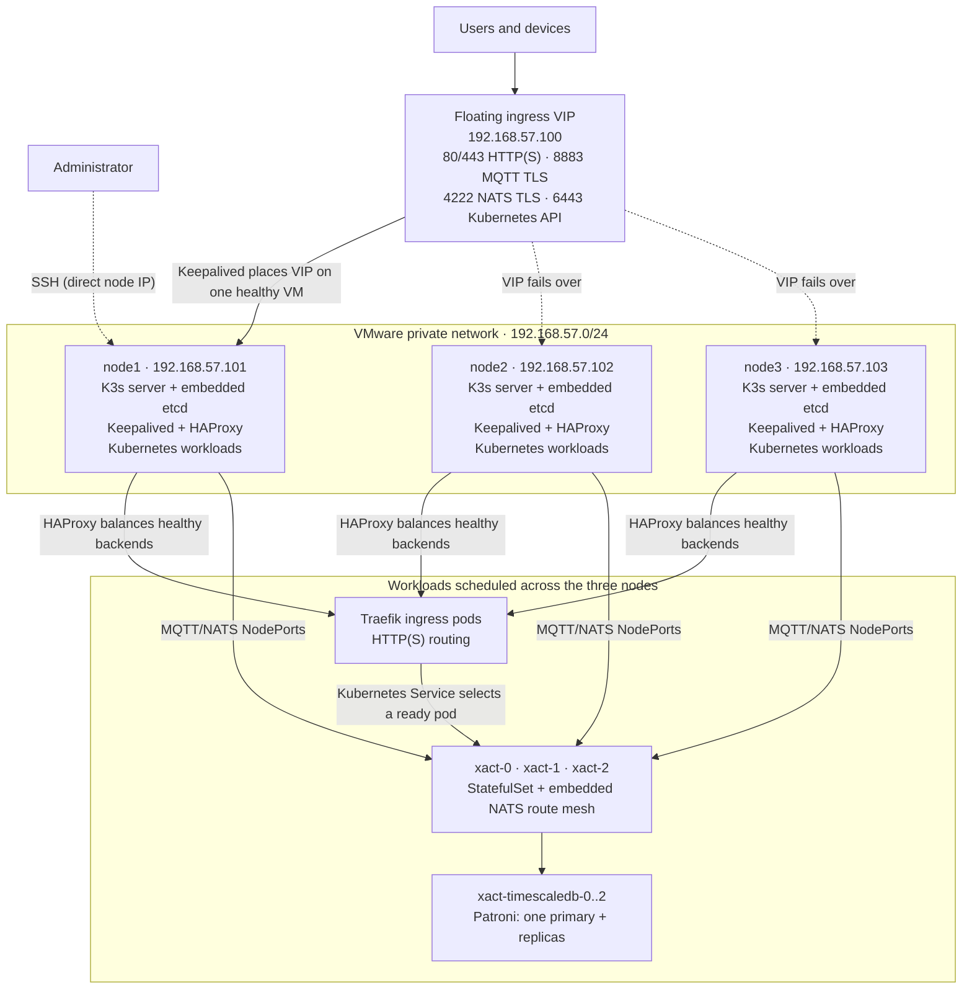

# XACT three-node HA cluster

This directory builds a local, three-VM K3s cluster and deploys the XACT edge,
TimescaleDB, and XACT application stack. Run all commands in this document from
`ha/` unless stated otherwise.

## Architecture



The pod boxes above show the desired application replicas, not a fixed
pod-to-node mapping. Kubernetes chooses placement and may reschedule a pod.
There is currently no pod anti-affinity or topology-spread rule guaranteeing
one XACT or TimescaleDB pod per VM. Check actual placement with `make pods`.

### Load sharing and failover

- **The VIP is failover, not load sharing.** Keepalived elects one VM to own
  `192.168.57.100`; priorities initially favour node1, then node2, then node3.
- **HAProxy shares new connections.** The active VIP owner sends K3s API,
  HTTP(S), MQTT, and NATS connections to healthy backends on all three nodes.
  With no explicit HAProxy algorithm configured, the default is round-robin.
- **Kubernetes shares service traffic.** NodePorts and Services select ready
  endpoints. Traefik routes `/xact` and `/xact/ws` to the three-replica XACT
  StatefulSet.
- **XACT's embedded NATS instances form a three-member route mesh.** This is
  application-level clustering in addition to Service balancing.
- **TimescaleDB uses Patroni with three members.** Writes use the primary
  service; a separate replica service is available for read-only traffic. It
  is primary/replica failover, not multi-primary write sharing.

The lab uses node-local `local-path` persistent volumes. Suspending a VM also
makes volumes on that VM unavailable, and storage recovery does not model
shared production storage.

## Addresses and ingress points

| Address | Use |
| --- | --- |
| `https://192.168.57.100/xact/` | XACT web/API ingress |
| `mqtts://192.168.57.100:8883` | MQTT TLS ingress |
| `nats://192.168.57.100:4222` | NATS client ingress; enable TLS in the client (HAProxy terminates it) |
| `https://192.168.57.100:6443` | K3s API used by kubeconfig |
| `192.168.57.101` | node1 administration/SSH |
| `192.168.57.102` | node2 administration/SSH |
| `192.168.57.103` | node3 administration/SSH |

Port 80 is the Traefik HTTP entry point and normally redirects/routes to the
HTTPS ingress. SSH deliberately bypasses the VIP.

## Create and bring up the cluster

Prerequisites are VMware Workstation/Fusion with the Vagrant VMware provider,
Vagrant, and Ansible. The initial deployment order matters because the edge VIP
must exist before node2 and node3 join K3s.

```bash
cd ha
make up
make ping
make prepare
make edge-deploy
make install
make edge-deploy
make configure-network
make verify
make edge-verify
make db-deploy
make db-verify
make xact-deploy
make xact-verify
```

On first use, `make up` creates the VMs but cannot install the stack; complete
the provisioning sequence above. Once provisioned, `make up` also waits for
Kubernetes, refreshes platform pods, restores TimescaleDB before XACT, and
waits for both StatefulSets to become ready:

```bash
make up
make status
make nodes
make pods
```

Use `make down` for routine development shutdowns. It scales XACT and then
TimescaleDB to zero so NATS, PostgreSQL, and their persistent state close
cleanly before halting all VMs. The next `make up` restores their configured
three replicas. Avoid suspend/resume for whole-cluster shutdown because saved
VM network state can leave VXLAN interfaces stale.

`make destroy` permanently deletes the VMs and requires the full deployment
sequence to rebuild them.

## Refresh a local XACT build

Build the local application image, import it into every K3s node, deploy it,
and wait for the rollout using one command:

```bash
make xact-refresh-local
```

The four stages run sequentially, and Make stops immediately if the build,
image load, deployment, or rollout verification returns an error. The
individual `xact-build-local-image`, `xact-load-local-image`,
`xact-deploy-local`, and `xact-verify` targets remain available for running a
single stage.

## Inspect the cluster

The SSH-backed commands require no host installation of `kubectl`:

```bash
make status                 # Vagrant VM state
make nodes                  # Kubernetes nodes and their IPs
make pods                   # all namespaces, pods, nodes, and pod IPs
make xact-status            # XACT StatefulSet, pods, volumes, and services
make db-status              # database pods, volumes, and services
make edge-verify            # HAProxy/Keepalived health and current VIP owner
```

For repeated administration, fetch a host kubeconfig and use a locally
installed `kubectl`:

```bash
make kubeconfig
KUBECONFIG=k3s/kubeconfig kubectl get nodes -o wide
KUBECONFIG=k3s/kubeconfig kubectl get pods -A -o wide
```

The shortcuts `make local-nodes` and `make local-pods` perform the last two
queries.

## SSH access

Use Vagrant's generated SSH configuration:

```bash
vagrant ssh node1
vagrant ssh node2
vagrant ssh node3
```

`make ssh-node1` is a shortcut for node1. From a node, run cluster commands as:

```bash
sudo k3s kubectl get nodes -o wide
sudo k3s kubectl get pods -A -o wide
```

## Failure testing

### Suspend or resume a VM

Suspend preserves VM memory and is useful for a temporary node outage:

```bash
vagrant suspend node2
vagrant status
vagrant resume node2
```

To test a cold stop/start instead:

```bash
vagrant halt node2
vagrant up node2
```

Keep at least two K3s servers running so the three-member embedded-etcd cluster
retains quorum. After recovery, use `make nodes`, `make pods`, and
`make edge-verify` to observe node readiness, pod placement, and VIP ownership.

### Stop or restart a pod

Pods managed by a StatefulSet/Deployment are restarted by deleting them; their
controller creates a replacement. This is the safest pod-level failure test:

```bash
# Find the exact pod name and its current node.
make pods

# Restart one XACT member and watch it return.
vagrant ssh node1 -c 'sudo k3s kubectl -n xact delete pod xact-1'
vagrant ssh node1 -c 'sudo k3s kubectl -n xact get pods -o wide -w'
```

The same pattern works for a database member, but first identify the primary
and prefer deleting a replica unless the test is explicitly exercising Patroni
primary failover:

```bash
vagrant ssh node1 -c 'sudo k3s kubectl -n database get pods -o wide'
vagrant ssh node1 -c 'sudo k3s kubectl -n database delete pod <pod-name>'
vagrant ssh node1 -c 'sudo k3s kubectl -n database get pods -w'
```

To stop all XACT pods deliberately, scale the controller to zero, then restore
the configured replica count of three:

```bash
vagrant ssh node1 -c 'sudo k3s kubectl -n xact scale statefulset/xact --replicas=0'
vagrant ssh node1 -c 'sudo k3s kubectl -n xact scale statefulset/xact --replicas=3'
vagrant ssh node1 -c 'sudo k3s kubectl -n xact rollout status statefulset/xact'
```

Do not scale TimescaleDB to zero as an ordinary restart procedure; doing so
removes database availability and bypasses the intended Patroni failover test.

### Logs and events

```bash
vagrant ssh node1 -c 'sudo k3s kubectl -n xact logs xact-0 --tail=200'
vagrant ssh node1 -c 'sudo k3s kubectl -n xact describe pod xact-0'
vagrant ssh node1 -c 'sudo k3s kubectl get events -A --sort-by=.lastTimestamp'
make db-logs
```

More detail is available in [`docs/ingress.md`](docs/ingress.md),
[`docs/database.md`](docs/database.md), and
[`docs/production-cluster.md`](docs/production-cluster.md).
