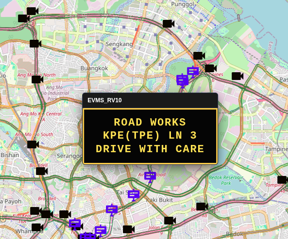
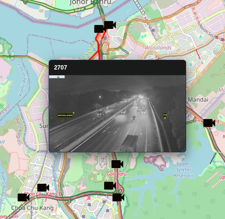
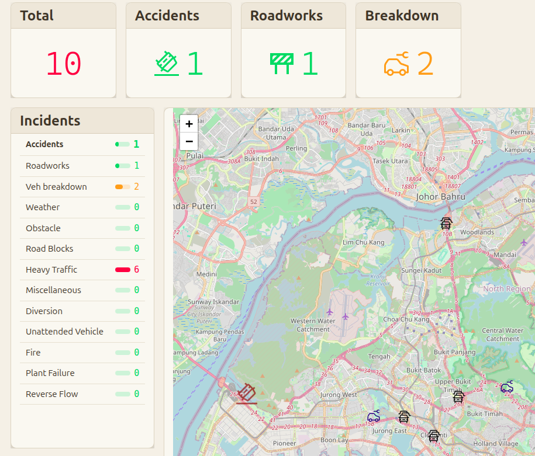
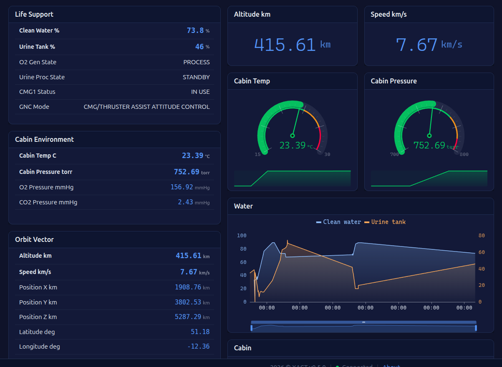
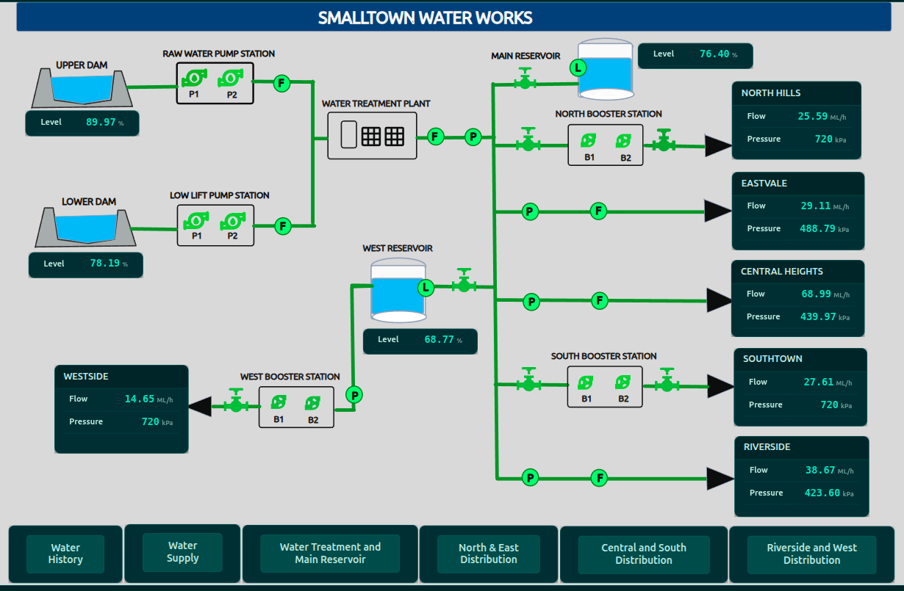
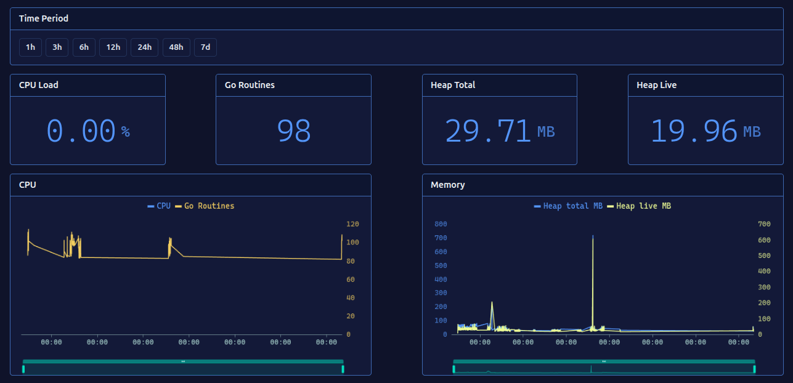
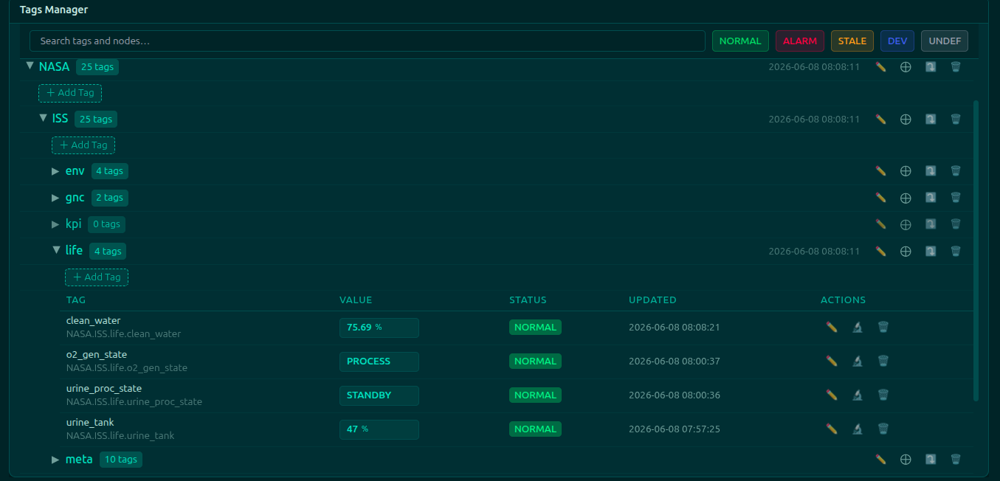
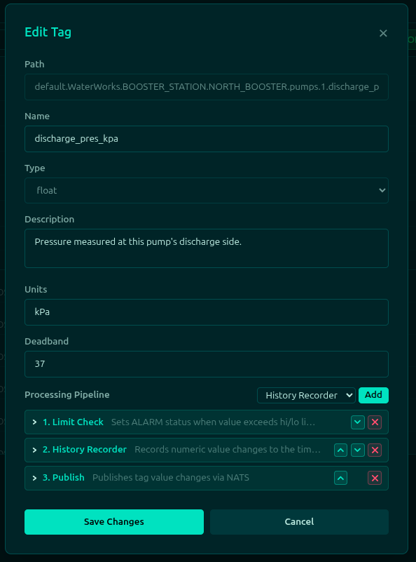
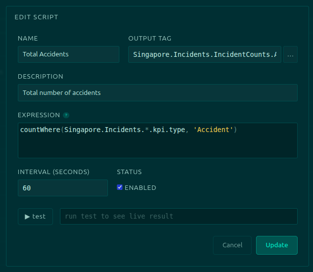
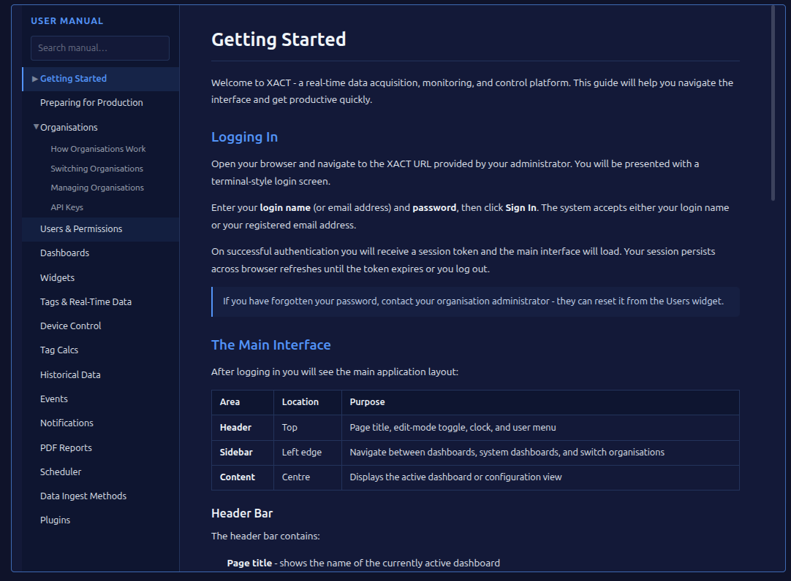

# XACT Screenshots

Return to the project's README [View readme](../README.md)

A small selection of screenshots from the demo system. 

Live traffic data provided by the Singapore LTA. Live ISS telementry provided by LightStreamer. The drivers for these are in the repo.

### Freeway Signs

Live freeway sign data from Singapore.

### Traffic Camera Images

Live traffic camera images from Singapore.

### Current incidents

Live incident data from Singapore. Shows a light theme.

### International Space Station

Live telemetry data from the ISS in a navy blue theme.

### SVG diagram

Demo data for a fictional water reticulation system.

### Server metrics

The XACT software's key performance metrics. Dark theme with bordered widgets.

### Tag manager

Engineering tool to view and configure the real time data. Green theme.

### Configuring a tag

Showing the data data processing pipeline at the bottom.

### Aggregate tag calculations

Example for counting the total number of incidents currently active.

### Online User Manual

